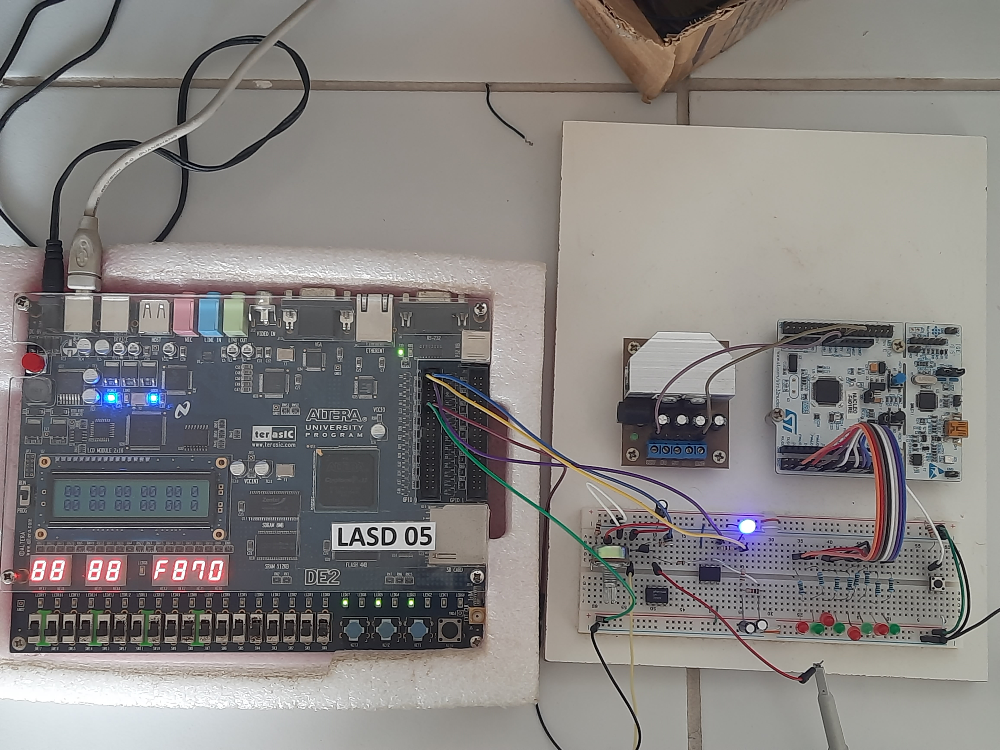
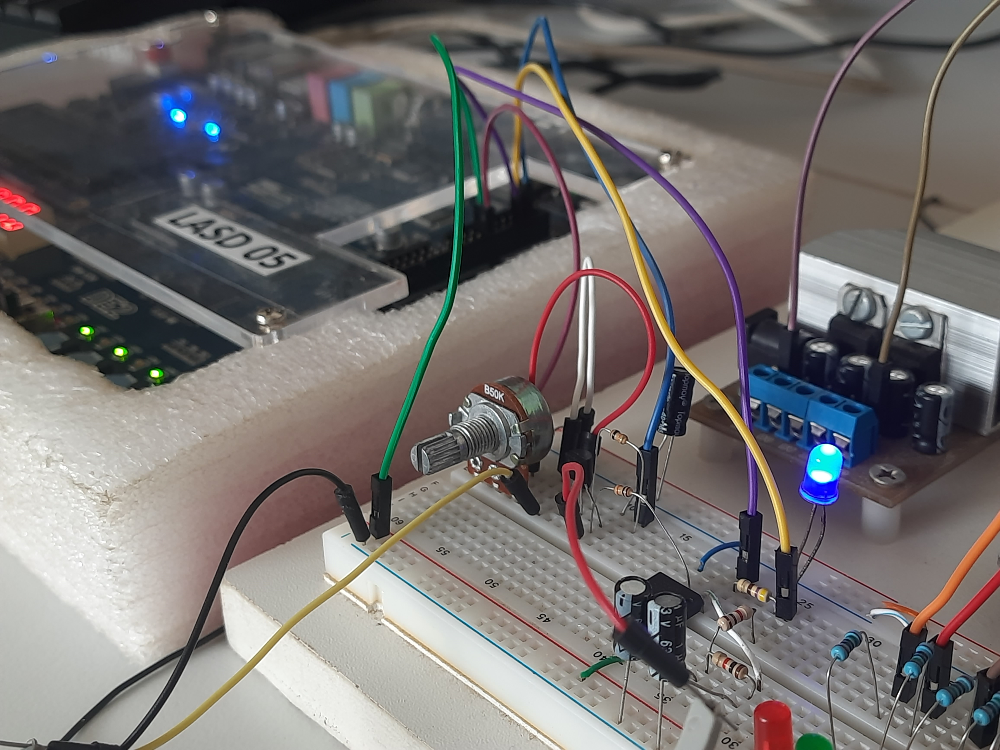
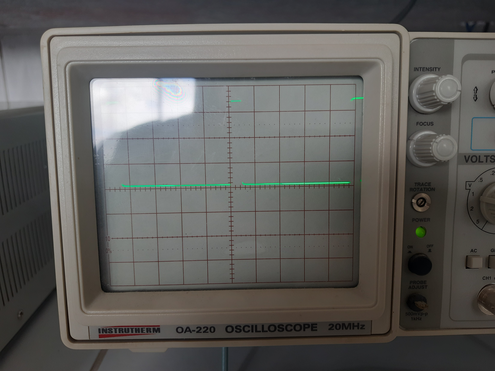
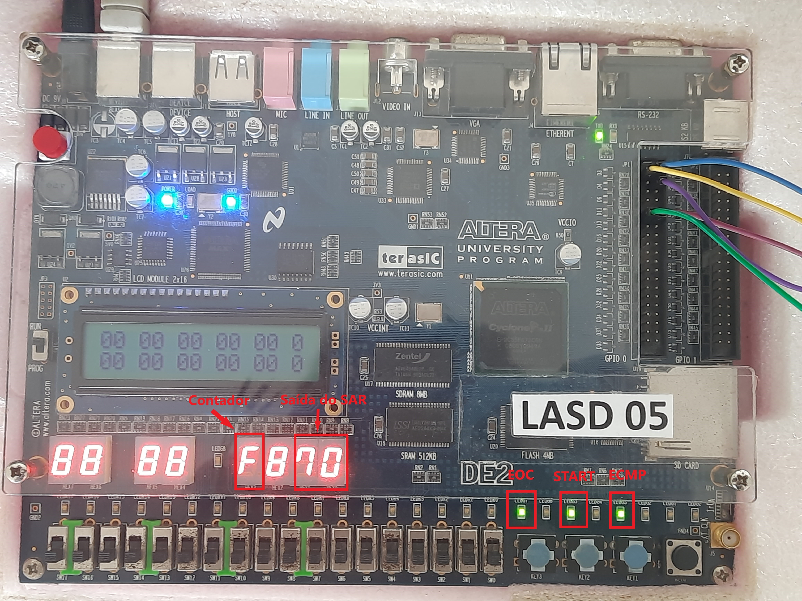

# LASD

Este repositório contém a arquitetura MIPS e o projeto de um conversor analógico digital (ADC) durante desenvolvida o Laboratório de Arquitetura de Sistemas Digitais (LASD), ministrado pelo professor Rafael Bezerra Correia Lima. Foram desenvolvidos 8 requisitos de hardware, 1 requisito de software e 1 projeto de disciplina que totalizam 10 Sprints. A arquitetura de sistemas implementada é baseada em MIPS 8 bits, e desenvolvidos e testados na FGPA Ciclone II EP2C35F672C6

## Sprints

| Sprints  |   |
|----------|---|
| [Sprint 1](/tree/sprint1) | Revisão Verilog 1 |  
| [Sprint 2](/tree/sprint2)| Revisão Verilog 2 |   
| [Sprint 3](/tree/sprint3)| Banco de registro  |   
| [Sprint 4](/tree/sprint4)| Unidade lógica aritmética   |   
| [Sprint 5](/tree/sprint5)| Unidade de controle  |   
| [Sprint 6](/tree/sprint6)| Memórias  |   
| [Sprint 7](/tree/sprint7)| Desvio  |   
| [Sprint 8](/tree/sprint8)| Entrada e saída paralela |
| [Sprint 9]()|   Verilog |  
| [Sprint 10](/tree/master)| Projeto | 

## Projeto: Digital Analog Converter using Successive Approximation Register (ADC SAR)

### Objetivos e motivações 
O Objetivo do projeto é a implementação de um Conversor Analógico Digital SAR, os conversores ADs são dispositivos responsáveis por digitalizar valores de tensão analógico, e são comumente encontrados em microcontroladores ou integrados em chips (ICs) e podem ser encontrados em diversos dispositivos digitais, como multímetros digitais, osciloscópios, termômetro digital além de serem amplamente utilizados na área de instrumentação digital. Entretanto, por mais que os ADCs estejam integrados a diversos dispositivos digitais, existem ainda exceções no mercado que não contam com este recurso. 

A FGPA Ciclone II EP2C35F672C6 utilizada no LASD é um desses dispositivos que não conta com um ADC nativo. Então, este projeto propõem o desenvolvimento de um ADC SAR que possibilite a interação da FGPA com recursos analógicos tais como sensores assim ampliando a capacidade de aplicações que poderão ser desenvolvidas utilizado este recurso.

### Recursos Implementados
- Contadores de 16 bits
- Módulos PWM
- Conversor digital-analógico
- Conversor analógico-digital

### Pinos
| I/0  | Função  |
|----------|---|
| GPIO_0[0]| Saída do sinal PWM (DAC) |  
| GPIO_0[1]| Saída do controle PWM da chave do S/H |   
| GPIO_0[3]| Leitura do comparador externo  | 

### Visualização dos Dados

Os bits do SAR são visualizados nos displays de 7-segmentos HEX0 e HEX1, o processo de iteração pode ser visualizado ajustando a taxa de conversão internamente no código (por padrão: 2 kHz, mas pode ser ajustado para 1 Hz caso deseje ver a conversão em tempo real). 

- `LEDG7`: exibe (flag eoc) quando o processo de conversão do SAR finalizou.
- `LEDG5`: exibe quando o botão de start (`KEY2`) é pressionado, permanecendo apagado enquanto pressionado.
- `LEDG3`: exibe o valor da leitura do comparador de tensão externo.

### Circuito Analógico
Mais detalhes podem ser [visto aqui](https://github.com/william-hazem/Projeto-de-Conversor-AD-SAR)